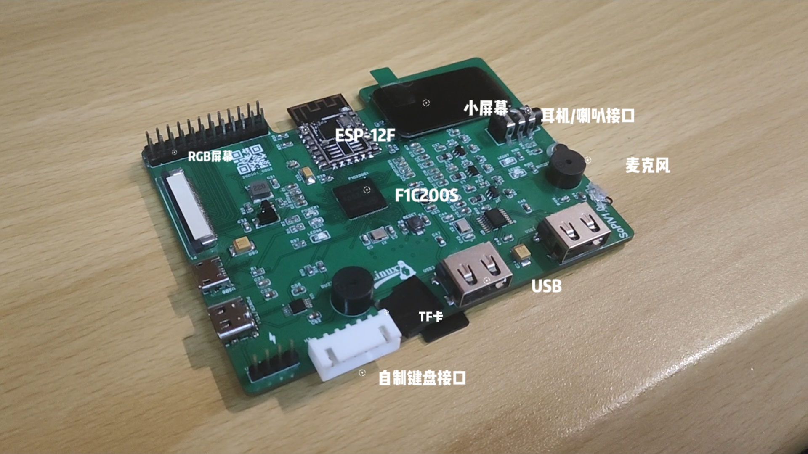
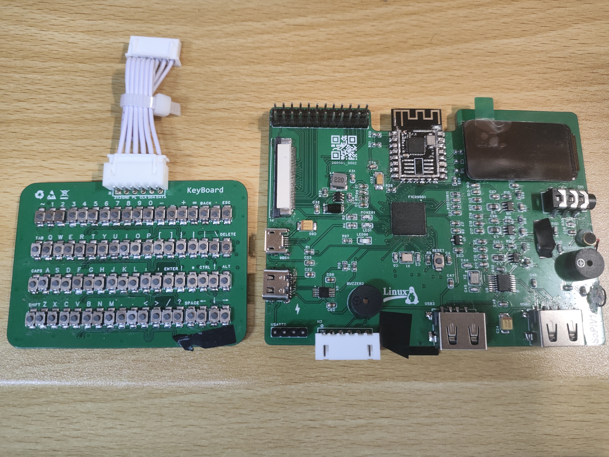

# F1c200s-Linux-Computer

This is a small computer designed by f1c200s

## 简介

使用F1c200s制作的linux小电脑，可以外接pcb键盘、usb键盘、小屏幕、RGB屏幕，包含音频和麦克风接口，使用ESP8266作为网卡，可联网，可以播放音视频，运行各种NES小游戏，外置了IO口开发其他驱动。

## 演示视频

https://www.bilibili.com/video/BV18xG76aE3N

## 使用

1.u-boot-nano-v2018.01可以直接编译运行

2.linux-5.7.1是Linux内核代码，编译运行

3.buildroot文件夹是配置好的文件系统

4.ESP8089-SPI-master是通过SPI让esp作为网卡使用的驱动代码

5.amr-NES-linu-master是nes游戏模拟器，编译运行

6.keyboard_drv来自up超级像素电子，是外置键盘的驱动代码

7.400_nes中包含了各种nes小游戏，从网上下载来的

8.PCB中包含了项目的原理图PCB，使用嘉立创专业版导入即可

## 参考教程资料

小白自制Linux开发板：https://whycan.com/t_7275.html

u-boot-nano-v2018.01 来自 https://github.com/Lichee-Pi/u-boot.git
linux-5.7.1 来自 https://mirrors.edge.kernel.org/pub/linux/kernel/v5.x/linux-5.7.1.tar.gz

buildroot-2018.02.11 来自 https://buildroot.org/downloads

键盘驱动来自up:超级像素电子

